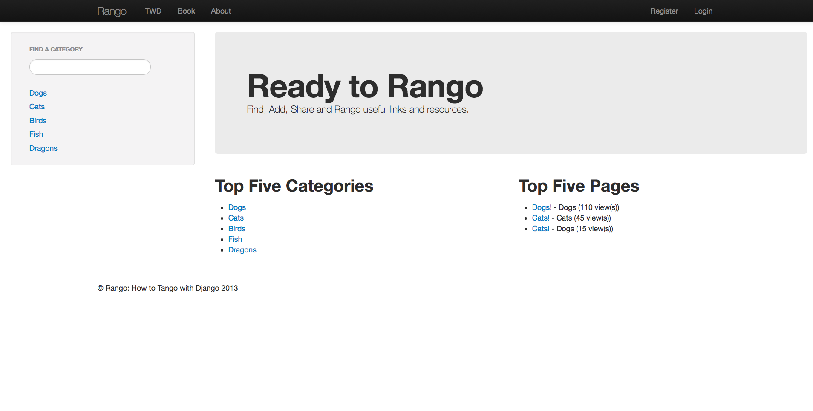

Rango - A Django Project
========================

<h4>Summary</h4>

A small Django web application which allows users to share links and categorize those links. Page views are tracked and users can "like" links.

<h4>Features</h4>
<ul class="black">
	<li>User login and cookie authentication</li>
	<li>CRUD based link archival system</li>
	<li>Unique user groups and permissions</li>
	<li>Use of the Bing search API (via JSON)</li>
	<li>Basic wireframing using Twitter Bootstrap v2.3</li>
</ul>

<h4>Tools</h4>

HTML, CSS, JavaScript, virtualenv, Pycharm, and Python (Django)
